<div align="center">

<!-- Dynamic Typing Banner -->


<!-- Animated Greeting Typing SVG -->
<a href="https://git.io/typing-svg">
  
</a>

<br/>

<!-- Profile Views + Followers Badges -->
<p>
  
  &nbsp;
  
  &nbsp;
  
</p>

</div>

---

## 🧠 About Me

<div align="center">



</div>

```python
class KavinduKalhara:
    def __init__(self):
        self.name        = "Kavindu Kalhara"
        self.username    = "kavindugunawardhana2026"
        self.university  = "University of Moratuwa 🎓"
        self.degree      = "B.Sc. in Artificial Intelligence"
        self.location    = "Sri Lanka 🇱🇰"
        self.email       = "kavindugunawardhana2026@gmail.com"

    @property
    def current_focus(self):
        return [
            "📐 Data Structures & Algorithms",
            "🐍 Python Programming",
            "🌐 Web Development (HTML, CSS, JS)",
            "🎨 UI/UX & Graphic Design",
            "🤖 Exploring AI & Machine Learning",
        ]

    @property
    def life_motto(self):
        return "Always learning new things 💡"

me = KavinduKalhara()
print(me.life_motto)
# Output: Always learning new things 💡
```


---

## 🚀 Tech Stack & Tools

<div align="center">


<br/>

**🌱 Currently Learning**


</div>

---

## 📊 GitHub Analytics

<div align="center">

<table>
  <tr>
    <td>
      
    </td>
    <td>
      
    </td>
  </tr>
</table>

<!-- GitHub Streak -->


<br/><br/>

<!-- Activity Graph -->


<!-- GitHub Trophies -->

</div>

---

## 🌟 Featured Projects

<div align="center">

<a href="https://github.com/kavindugunawardhana2026">
  
</a>

</div>

> 💡 **Currently Working On:** Building web projects & exploring AI foundations  
> 🎯 **2025 Goals:** Build cool projects · Get internship experience · Learn AI/ML hands-on  
> 💬 **Ask me about:** Web Dev, Java, Python, Design, or university life at UoM!

---

## 📈 Coding Activity

<!--START_SECTION:waka-->
```text
Python       ████████████████░░░░░   65 %
JavaScript   ████████░░░░░░░░░░░░░   30 %
Java         ██░░░░░░░░░░░░░░░░░░░    5 %
```
<!--END_SECTION:waka-->

---

## 🐍 Contribution Snake

<div align="center">
  <picture>
    <source media="(prefers-color-scheme: dark)" srcset="https://raw.githubusercontent.com/kavindugunawardhana2026/kavindugunawardhana2026/output/github-snake-dark.svg"/>
    <source media="(prefers-color-scheme: light)" srcset="https://raw.githubusercontent.com/kavindugunawardhana2026/kavindugunawardhana2026/output/github-snake.svg"/>
    
  </picture>
</div>

---

## 🤝 Connect With Me

<div align="center">

<a href="https://twitter.com/" target="_blank">
  
</a>
&nbsp;
<a href="https://linkedin.com/in/" target="_blank">
  
</a>
&nbsp;
<a href="https://facebook.com/" target="_blank">
  
</a>
&nbsp;
<a href="https://instagram.com/" target="_blank">
  
</a>
&nbsp;
<a href="mailto:kavindugunawardhana2026@gmail.com">
  
</a>
&nbsp;
<a href="https://dev.to/" target="_blank">
  
</a>

<br/><br/>

<!-- Random Dev Quote -->


</div>

---

<div align="center">

<!-- Footer Wave -->


<p>
  
</p>

⭐ **Star my repos if you find them useful!** ⭐

</div>
